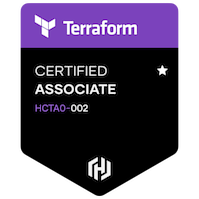
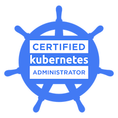

# 💫 About Me:
Hey! I'm Sibi saravanan.   

## 🌐 Socials:
   

# 💻 Tech Stack:
                 

# Certifications:
        

# 📊 GitHub Stats:
    

## 🏆 GitHub Trophies

### ✍️ Random Dev Quote

### 🔝 Top Contributed Repo

---

<!-- Proudly created with GPRM ( https://gprm.itsvg.in ) -->
